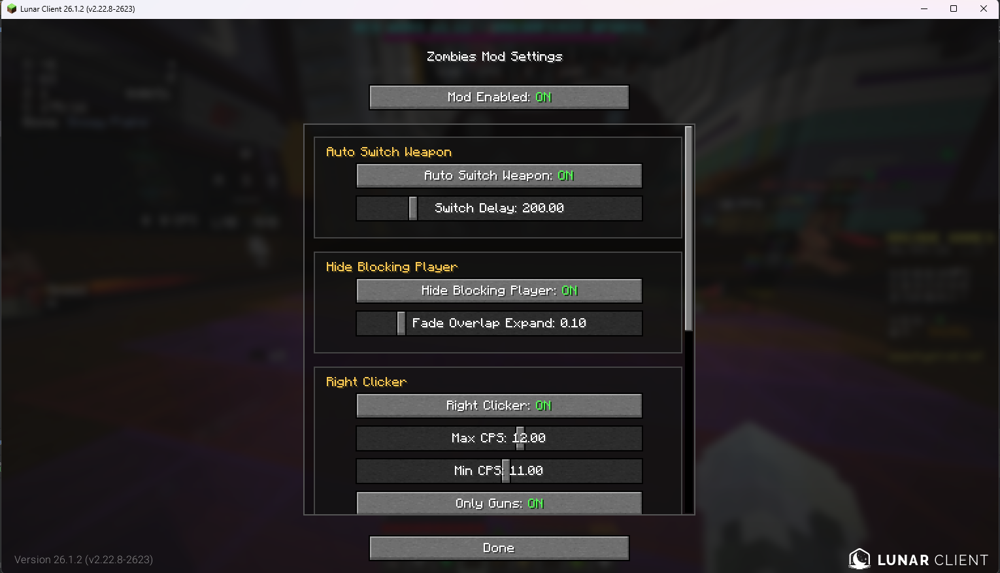

# Hypixel Zombies Mod
Hypixe僵尸末日辅助Mod
版本: Minecraft 26.3 Fabric（Java 25 或更高版本）

## 构建与兼容性检查

- Minecraft 26.3、Fabric Loader 0.19.5+、Fabric API 0.161.0+26.3。
- 使用 Java 25 或更高版本运行 `./gradlew build`（Windows：`gradlew.bat build`）。
- 成品位于 `build/libs/zombies-mod-1.0.0.jar`。
- `build` 自动执行 `verifyPort`：在真实 Fabric 环境中验证全部 Mixin，检查旧快捷键迁移，并编译自定义着色器；无需启动游戏窗口或登录账号。
- 独立运行检查：`./gradlew verifyPort`。

本分支移植了 `mc-26.2-test` 的全部模块和资源，并保留原分支的模块注册和默认开关状态。
26.3 的键盘输入改为 SDL 扫描码；首次读取旧版 `config/zombies-mod.json` 时会转换 GUI、模块、枪械及快捷栏的按键绑定，保存时记录新格式，避免重复转换。
原版中没有对应按键的旧绑定（如 F25）会解除绑定，可在配置界面重新设置。

自动检查覆盖编译、注入和着色器兼容性；实际画面效果及 Hypixel 游戏内交互仍需在客户端中验证。

### 截图

## Feature
| Module | Description |
|------|---------|
| Auto Switch Weapon | 右键自动切换枪械 |
| Hide Blocking Player | 重叠时隐藏玩家 |
| No Fire Effect | 去除燃烧特效 |
| Right Clicker | 右键连点器 |
| Sprint | 强制疾跑 |
| Target Hud | 显示目标血量信息 |
| Teammate Glow | 队友高亮显示 |
| DPSCounter | DPS计算 |
| Wave Display | AA怪物波数显示 |
| Zombie Chams | 僵尸穿墙显示 |
| Stats Query | 玩家僵尸末日战绩查询 |
| AA Powerup Predictor | AA道具掉落预测 |
| No Gun Fire | 屏蔽开枪火焰 |

# 声明,鸣谢
[`Hypixel API`](https://github.com/HypixelDev/PublicAPI.git)

部分数据来源
[`ShowSpawnTime by Seosean`](https://github.com/Seosean/ShowSpawnTime.git)
